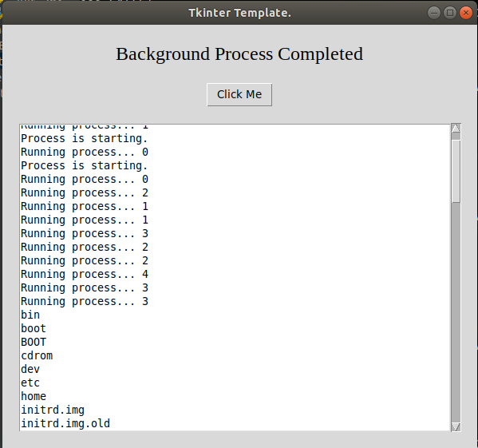

# Tkinter-Template-Multithreaded-Background-Processes

This code has been tested for Python 3.8.1, and doesn't have any 3rd party packages.

This is a template for Tkinter GUI apps to run multiple processes without blocking the main thread and causing the GUI app to freeze.

The background process run in their own thread, and doesn't block the main GUI app. 
The background process communicates with the Tkinter GUI through a queue data structure.

In this template, I'm having the background processes count to 5 and then show the contents of the root directory. 
The background process adds messages to the queue. 
The Tkinter GUI app checks the queue every 100 milliseconds, and then displays the messages on a terminal like box. 

Below is an example for Linux. Non of the background processes freeze the GUI.

